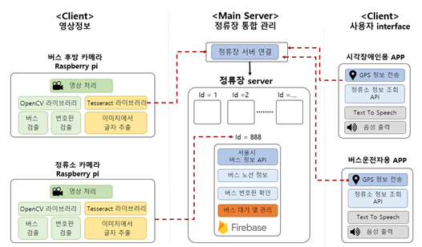
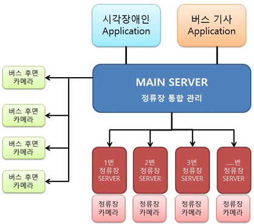

# 버스어딨SSU(Where is Bus?)
> 시각장애인을 위한 정류장 음성 안내 서비스

### 시스템 구성도

### 서버 구조

+ 모든 버스의 후방 카메라 모듈과 정류장 서버는 MainServer(메인 서버)와 연결
+ 각 정류장의 라즈베리파이는 해당 StServer(정류장 서버)와 연결

-----

1. 먼저 정류장의 라즈베리파이가 맨 앞 버스Object를 탐지하면 그 버스의 번호판을 탐지하고 OCR로 차량번호를 인식한다 
2. 탐지된 버스들은 각 정류장 서버의 버스 순서열(링크드리스트)을 통해 관리되고 자동으로 메인서버에 해당 차량번호로 요청을 보낸다 
3. 메인서버는 정류장으로부터 차량번호 데이터를 수신하면 해당 차량번호에 맞는 버스와 연결된 소켓을 찾아 그 버스의 후방 카메라 모듈을 작동시킨다 
4. 후방 카메라 모듈 또한 버스Object를 탐지하고 버스의 번호판을 인식하여 메인서버로 송신한다 
5. 후방 카메라 모듈로부터 버스 차량번호를 수신받은 메인서버는 해당 버스를 요청한 정류장 서버로 해당 차량번호를 전달한다 
6. 해당 정보를 받은 정류장 서버는 차례대로 순서열에 관리한다 
7. Timeout시간을 두어 일정시간 데이터가 수신(인식)되지 않을 경우에는 버스가 출발한 것으로 판단하여 해당 버스를 pop()한다  
8. 사용자는 어플리케이션을 통해 해당 서버에 접속할 수 있다 
9. 먼저 메인서버에 접속되고 GPS와 서울시 버스 정류장 API를 통해 인근 정류장의 ID를 얻는다 
10. 해당 결과값을 메인서버에 송신하면 메인서버는 해당 ID에 맞는 정류장의 주소를 리턴하고 어플리케이션은 그 주소를 바탕으로 인근 정류장서버에 연결한다 
11. 화면의 버튼을 누르면 인근 정류장서버로 부터 순서열을 받고 TTS를 통해 음성으로 해당 정보를 제공받는다.

 
